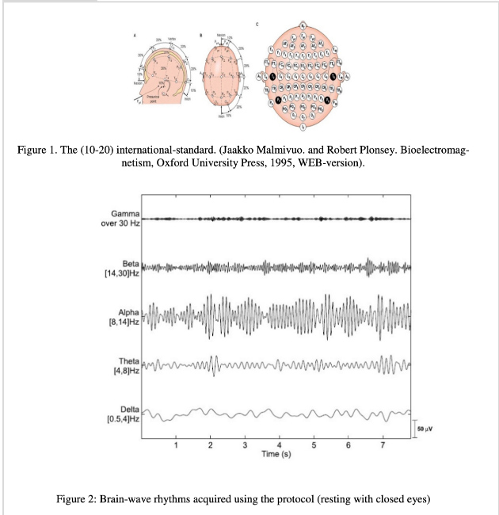
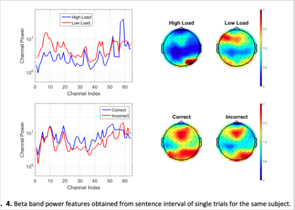
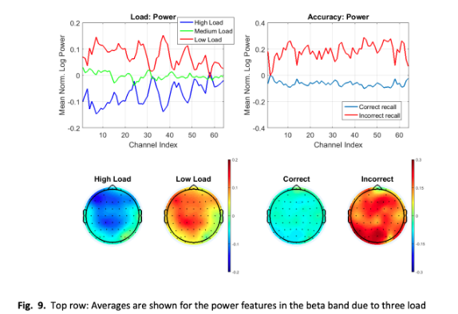

# EEG data  description
## Metadata
Electroencephalography, accelerometer, gyroscope, and other data from the device are structured in the .csv file as follows:  
1. column: the timestamp in Unix time of sample collection.
2. 21 columns: the processed EEG data for each channel in the 5 frequency bands, respectively:  
   2. Delta-TP9,    
   3. Delta-AF7,    
   4. Delta-AF8,    
   5. Delta-TP10;   
   6. Theta-TP9,    
   7. Theta-AF7,    
   8. Theta-AF8,    
   9. Theta-TP10,   
   10. Alpha-TP9,   
   11. Alpha-AF7,   
   12. Alpha-AF8,   
   13. Alpha-TP10,  
   14. Beta-TP9,    
   15. Beta-AF7,    
   16. Beta-AF8,    
   17. Beta-TP10,   
   18. Gamma-TP9,   
   19. Gamma-AF7,   
   20. Gamma-AF8,   
   21. Gamma-TP10   
    The decomposition algorithm used is Fast Fourier Transform (FFT) with a Hamming window.
3. 22 – 25. columns: the raw EEG data for respectively TP9, AF7, AF8, TP10 channels in microvolt (uV). 
4. 26 - 27 columns: are two extra channels (AUX_RIGHT and AUX_LEFT respectively) that were not used for our purpose. The values that they contain show the open channels noise. 
5. 28 - 30 columns: are the accelerometer data for respectively x, y, z axis measured in g (m/s2), where the x-axis represents the tilt up/down, the y-axis the tilt left/right, and the z-axis the vertical motion up/down (e.g. jumping). 
6. 31 - 33 columns: are the gyroscope data for respectively x, y, z axis measured in (degree/s), where the x-axis represents the tilt left/right (Roll), y the tilt up/down (Pitch) and z the rotation left/right (Yaw). 34. column: is the value showing the switched-on device (Headband On). 
7. 34 columns: are HIS channels (Horse Shoe Indicator) showing the sensor connectivity status. 
8. 35 column: is the battery status of the device. 
9. 36 column: “Elements” shows events occurred during the recording and automatically stored such as the connection of the device, blink, jaw_clench.

| Data-type     | Description                                                                                                          |
|---------------|----------------------------------------------------------------------------------------------------------------------|
| time          | Unix time of sample collection                                                                                      |
| bvp           | Blood Volume Pulse signal                                                                                            |
| eda           | Electrodermal Activity signal                                                                                        |
| temp          | Body surface temperature                                                                                             |
| eeg           | Electroencephalography, accelerometer, gyroscope, and other data from the device are structured in the .csv file as follow: 1. column: the timestamp in Unix time of sample collection. 2. – 21. columns: the processed EEG data for each channel in the 5 frequency bands (respectively: Delta-TP9, Delta-AF7, Delta-AF8, Delta-TP10; Theta-TP9, Theta-AF7, Theta-AF8, Theta-TP10, Alpha-TP9, Alpha-AF7, Alpha-AF8, Alpha-TP10, Beta-TP9, Beta-AF7, Beta-AF8, Beta-TP10, Gamma-TP9, Gamma-AF7, Gamma-AF8, Gamma-TP10). The decomposition algorithm used is Fast Fourier Transform (FFT) with a Hamming window. 22. – 25. columns: the raw EEG data for respectively TP9, AF7, AF8, TP10 channels in microvolt (uV). 26. – 27. columns: are two extra channels (AUX_RIGHT and AUX_LEFT respectively) that were not used for our purpose. The values that they contain show the open channels noise. 28. – 30. columns: are the accelerometer data for respectively x, y, z axis measured in g (m/s2), where the x-axis represents the tilt up/down, the y-axis the tilt left/right, and the z-axis the vertical motion up/down (e.g. jumping). 31. – 33. columns: are the gyroscope data for respectively x, y, z axis measured in (degree/s), where the x-axis represents the tilt left/right (Roll), y the tilt up/down (Pitch) and z the rotation left/right (Yaw). 34. column: is the value showing the switched-on device (Headband On). 35. – 38. columns: are HIS channels (Horse Shoe Indicator) showing the sensor connectivity status. 39. column: is the battery status of the device. 40. column: “Elements” shows events occurred during the recording and automatically stored such as the connection of the device, blink, jaw_clench. |

## Data Analysis
EEG signals in different frequency bands (Delta, Theta, Alpha, Beta, Gamma) can indicate different cognitive states. For example, increased power in the Theta band may suggest increased cognitive workload or engagement, while increased Alpha band power may indicate relaxation or decreased cognitive load.
Each of the electrodes (e.g., TP9, AF7, AF8, TP10) collects EEG signals from specific regions of the brain. Therefore, the Delta, Theta, Alpha, Beta, and Gamma values for each electrode represent the power or magnitude of brainwave activity within those frequency bands at those specific brain regions. Analyzing these values across electrodes can provide insights into brain activity patterns and cognitive processes occurring in different brain regions during various tasks or states.
Measuring Cognitive Load Based on EEG Data in the Intelligent Learning Systems
https://ceur-ws.org/Vol-2861/paper_40.pdf
Traditionally, five frequency ranges are distinguished in the EEG: δ delta (less than 4 Hz), θ theta (from 4 to less than 8 Hz), α alpha (from 8 to less than 13 Hz), β beta (from 13 to less than 30 Hz), γ gamma (more than 30 Hz) [10]. With neurological activity in different areas of the brain, electrical waves are generated at different frequencies with greater or lesser strength, depending on the cognitive task being performed. EEG allows recording electrical signals that are generated during activation and deactivation of neurons involved in a cognitive task.
### 2.3. Measuring cognitive load using EEG data 
Cognitive load is a quantitative measure of the mental effort required to complete a task [15]. Cognitive load reflects the resources spent by working memory. Methods for measuring cognitive load are divided into subjective and objective. The first group of methods for measurement uses subjective rating scales, such as NASA-TLX or an adapted version of Paas's 9-point symmetric categorical scale for assessing mental effort. Subjective assessment is usually made by answering the question "Please rate the amount of mental effort invested in the task" on a qualitative scale (from "very very low mental effort" to "very, very high mental effort"). The question is asked immediately after completion of the tasks. Subjective rating scales do not provide an indication of fluctuations in cognitive load during task performance. Objective methods for measuring cognitive load are divided into two groups: methods for measuring cognitive load for secondary tasks and methods based on measuring physiological indicators. 
The most widely used methods of the latter group are methods for assessing cognitive load according to EEG data [16]. Currently, there is no unambiguous way to assess cognitive load using EEG data. The most commonly used methods include [16, 17]: 1) event-related desynchronization and synchronization (ERD / ERS index), 2) theta-alpha ratio (TAR index), 3) methods based on machine learning. 
The first method reflects the percentage decrease (event-related desynchronization, ERD) or increase (event-related synchronization; ERS) in band power during the activation interval compared to the baseline interval. The baseline (or reference) interval usually reflects the period of time before the stimulus without any requirement for the task. The activation interval refers to the time period while working on a task. To assess the cognitive load, the ERD / ERS index is used, which can be calculated using the formula [16]: 

𝐸𝑅𝐷 𝐸𝑅𝑆 % = BaseLineIntBandPower−TaskIntBandPower BaseLineIntBandPower × 100, (1)

 where BaseLineIntBandPower is baseline interval band power, TaskIntBandPower is task interval band power. Measurement of the ERD / ERS index is done for each electrode and task and then averaged over the tasks to improve reliability. 

The second method is based on the calculation of the theta-alpha ratio, which in recent years has been considered as a potentially important indicator of the study of cognitive abilities. It is assumed that the theta-alpha ratio differs depending on age and cognitive abilities, and therefore this indicator can be used both to measure cognitive load and to identify cognitive impairments in the elderly [18]. The TAR index can be calculated using the following formula [17]: 

𝑇𝐴𝑅 = (thetaF3 + thetaF4) / ( alphaP7 + alphaP8)

, (2) where thetaF3 and thetaF4 are spectral powers of theta band in the electrodes F3 and F4 (frontal region in both hemispheres of the brain), alphaP7 и alphaP8 are the spectral powers of the alpha band in the electrodes P7 and P8 (parietal region of both hemispheres of the brain). Spectral power for frequency bands can be obtained using Fast Fourier Transform. 

https://files.eric.ed.gov/fulltext/EJ1166131.pdf - EEG measures of Theta–Alpha channels in frontal and parietal brain regions have been found to correlate with the mental/cognitive load. Most studies demonstrated that frontal Theta increases with higher cognitive load and Alpha decreases with a higher cognitive load

https://www.mdpi.com/2504-3900/31/1/70 - The brain produces very low-frequency electrical waves (<1 Hz) in the electroencephalogram (EEG) of sleep stages, between the 0.55–0.95 Hz range and with peaks at 0.7–0.8 Hz in the frequency band known as delta [13]. On the other hand, higher frequencies and faster waves predominate in waking conditions, where bands oscillate between 0.5–40 Hz. The intervals that correspond to each band are as follows: 0.5–4 Hz (delta band), 4–8 Hz (theta band), 8–13 Hz (alpha band), 13–30 (beta band), and finally 30–40 Hz (gamma band). As stated before, the composition of the electrical response strongly depends on the cognitive task.
4.3. EEG Data Processing
Participants performed all the tasks described in Table 2, specifically, three defined tasks per category considered in the HuSBIT-10 proposed taxonomy. EEG activity was recorded during each task for a 10-s interval (EEG segment). The recorded EEG data can be found in the link in Section Supplementary Material.
The EEG segments, denoted as <Participant_Id, Task Type>, were then analyzed to estimate cognitive load in accordance with the following procedure: first (i), each EEG segment was preprocessed applying a 2–15 Hz bandpass filter to remove frequencies that were not under analysis (neither alpha nor theta band were removed); then (ii), zScore normalization was performed on the filtered EEG signals to made possible relative comparisons across EEG segments for all the participants in the next steps. After pre-processing (iii), each normalized EEG segment was split into 1-s windows with 50% overlapping; later (iv), a variation of the TAR index was computed for each analysis window within the EEG segment, as indicated below:
TAR = (thetaF3 + thetaF4)/(alphaP7 + alphaP8)
(1)
where thetaF3 and thetaF4 were the spectral power of the theta band in the F3 and F4 electrodes (frontal area in both brain hemispheres); and alphaP7 and alphaP8 the spectral power of the alpha band in the P7 and P8 electrodes (parietal area in both brain hemispheres). Once theta-alpha ratio values were obtained for each analysis window (v), the TAR index was averaged for the entire EEG segment that enclosed them all. This average TAR index (for the current EEG segment) was considered as a cognitive load estimation for a particular task performed by one participant (<Participant_Id, Task Type>). If the average TAR indices across all participants are grouped by task and again averaged, cognitive load estimations for each particular task will be obtained.

The third group of methods presupposes the presence of a labeled training sample for training the classifier, the creation of which is extremely problematic in the context of the problem under consideration due to the lengthy process of data collection and labeling.

## BRAIN COMPUTER INTERFACE FOR BIOMETRIC AUTHENTICATION BY RECORDING SIGNAL
https://www.researchgate.net/publication/333471656_BRAIN_COMPUTER_INTERFACE_FOR_BIOMETRIC_AUTHENTICATION_BY_RECORDING_SIGNAL
3.
M
ETHODOLOGY
3.1 EEG Brain Signal
EEG is used to measure brain waves from frequencies in the head region. These waves are
obtained by placing electrodes according to the international measurement system 10-20 (the
distance between the points landmark, namely the nasion, the inion, = “10” – “20”
٪
) as in Fig. (1
(a,b)), which is used to detect and record pulses from the brain (Draw lines at intersections),
through the distinct points are known where the position of poles result of the arrow formed by
the intersections of the lines and the withdrawal of the corona at “10” or “20”%, this distance will
be between nasion and inion [6] these recordings are the amount of contiguous and interrelated
neurons. Here, it should be noted that the difference in the positions of the poles of the recording
leads to the difference of EEG,[1], for more detailed description, see below:
1. Delta
The Delta rhythm is an oscillation activity that reaches 4 Hz. This activity tends to have slower
waves and higher amplitude. The adults are seen in slow sleep wave, may occur most commonly
throughout the scalp, while in newborns we notice that the delta rhythms are slow
2. Theta
Theta consists of a frequency range of 4 to 7 Hz. Theta can be observed in children during
drowsiness or can be observed during the effects of older children, while the appearance of theta
in adults is an abnormal activity, Here, it should be noted that changes in the theta of the scalp are
hard to find without help (computational Methods of EEG raw effects) [7].
3. Alpha
Alpha oscillation activity ranges from 8 to 12 Hz, the first activity of the EEG is due to the
researcher Hans Berger who called it (alpha wave), It is the basic posterior rhythm, it is also
called alpha posterior rhythm, it should be noted here that this rhythm is seen in the side areas of
the scalp, The capacity of alpha brain vibrations is large and can be seen clearly in raw traces
EEG, this is done in (specific mental states), be well visible with closed eyes and weaken in the
case of eye opening or exposure to exertion. This can be seen in Figure (2).
4. Beta
The frequency ranges here at the beta rhythm ranges from 14 to 30 Hz. This rhythm can be seen
clearly in the physical sensory areas (Front, motor, parietal) regions. This activity is concentrated
in the case of alertness [8].
5. Gamma
The frequency ranges in gamma ranges from 30 to 100 Hz. In this band, synchronization in
neurons is very important for functional integration through brain regions, it is believed that
gamma rhythms work on the association between different nerve groups for the purpose of
generating
cognitive
function
or
kinetics
[1],
These
functions
include
active
information
processing (identification of sensory stimuli), gamma activity can be recorded from the electrodes
o
f the scalp and its frequency does not exceed (45 Hz) [9]

(9) (PDF) BRAIN COMPUTER INTERFACE FOR BIOMETRIC AUTHENTICATION BY RECORDING SIGNAL. 

Available from: https://www.researchgate.net/publication/333471656_BRAIN_COMPUTER_INTERFACE_FOR_BIOMETRIC_AUTHENTICATION_BY_RECORDING_SIGNAL
 [accessed Feb 21 2024].

## Using EEG to discriminate cognitive workload and performance based on neural activation and connectivity
https://apps.dtic.mil/sti/tr/pdf/AD1033658.pdf 

